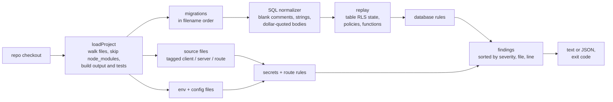

# supabase-prod-check

[](https://github.com/ahzab/supabase-prod-check/actions/workflows/ci.yml)


Static checks for Supabase + Next.js apps that catch the mistakes which pass every test locally and only hurt in production: a table without row level security, the service role key in a client component, a cron route anyone can call, a Stripe webhook that trusts whatever is posted to it.

It reads `supabase/migrations` and your source. It never connects to a database, never runs your code and needs no credentials, so it is safe to run on any checkout and in CI.

```text
$ npx github:ahzab/supabase-prod-check examples/broken-app

error  .env.example:4  NEXT_PUBLIC_STRIPE_SECRET_KEY is inlined into the browser bundle: drop the public prefix and read it only on the server
error  app/api/cron/cleanup/route.ts:4  cron route runs for any caller: compare the Authorization header to `Bearer ${process.env.CRON_SECRET}` and return 401 otherwise
error  app/api/stripe/webhook/route.ts:7  Stripe webhook parses the body without stripe.webhooks.constructEvent(rawBody, signature, secret)
error  components/AdminPanel.tsx:6  browser code references the service role key: move this call to a route handler or server action
error  supabase/migrations/20240101000000_init.sql:12  table "orders" never enables row level security: add `alter table orders enable row level security;`
error  supabase/migrations/20240201000000_credits.sql:13  table "profiles" has row level security switched off again here: remove the disable or re-enable it in a later migration
warn   (project)  no /api/health route: add one that runs a cheap query and answers 503 when it fails
warn   app/api/stripe/webhook/route.ts:7  no sign of dedupe on event.id: store processed event ids with a unique key before acting
warn   lib/orders.ts:9  empty catch: log the error and return a non-2xx status, or let it throw
warn   supabase/migrations/20240101000000_init.sql:24  policy anyone can post on public.feedback lets anon, authenticated insert any row: scope it to auth.uid()
warn   supabase/migrations/20240201000000_credits.sql:2  function grant_credits(uid uuid, amount int) is SECURITY DEFINER without `set search_path = ''`
note   supabase/migrations/20240101000000_init.sql:28  table "audit_log" has RLS on and no policy, so only the service role can reach it. Fine if that is intended

2 migration(s), 4 source file(s) checked: 6 error(s), 5 warning(s), 1 note(s)
```

## Why this exists

Most apps built on Supabase get their security from row level security, and RLS is opt-in per table. The anon key is public by design; it ships in every page. So a single `create table` without an `enable row level security` publishes that table through the REST API to anyone who opens the browser console. Nothing fails. The app works, the tests pass, and the leak shows up when someone else finds it.

The same is true of the mistakes around it: a cron route with no secret, a webhook that skips signature verification, a secret named `NEXT_PUBLIC_*`. Each one is a line or two of code, easy to catch by reading, and easy to miss in review because the app keeps working. This tool reads for them.

I wrote the first version as a shell script in the release gate for my own products, after problems of this kind (a database paused behind a page that still rendered, scheduled jobs failing without anyone noticing) reached production without a single error. This is that gate rewritten as a standalone, tested tool, with the Supabase-specific checks added.

## Checks

| Rule | Level | What it catches |
|---|---|---|
| `rls-disabled` | error | A public table that never enables RLS, or has it switched off again by a later migration |
| `service-role-in-client` | error | The service role key referenced from a `"use client"` file, or anywhere under `src/` in a Vite app |
| `public-secret-env` | error | `NEXT_PUBLIC_`, `VITE_`, `EXPO_PUBLIC_` or `PUBLIC_` variables named like a secret, service role or private key |
| `cron-no-auth` | error | A route under `api/cron/` that never checks `CRON_SECRET` or an `Authorization` header |
| `stripe-webhook-unsigned` | error | A Stripe webhook route that never calls `stripe.webhooks.constructEvent` |
| `permissive-write-policy` | warn | An insert, update, delete or `all` policy for `anon` or `public` that is just `using (true)` / `with check (true)` |
| `security-definer-search-path` | warn | A `SECURITY DEFINER` function with no pinned `search_path` |
| `stripe-webhook-idempotency` | warn | A Stripe webhook with no sign of deduplicating on `event.id` |
| `health-route` | warn | A Next.js app with no `/api/health`, or one that never queries the database |
| `server-empty-catch` | warn | An empty `catch {}` in a route handler, server action or server-only module |
| `rls-no-policy` | note | RLS on with no policy: correct for a server-only table, a silent empty result otherwise |

`supabase-prod-check --rules` prints each rule with the reason it exists.

## Usage

```sh
# from any Next.js + Supabase repo
npx github:ahzab/supabase-prod-check

# a specific directory, JSON for tooling, warnings fail too
npx github:ahzab/supabase-prod-check ./apps/web --json --strict

# run or skip specific rules
npx github:ahzab/supabase-prod-check --only rls-disabled,service-role-in-client
npx github:ahzab/supabase-prod-check --skip health-route
```

Exit codes: `0` clean, `1` errors (or warnings under `--strict`), `2` usage error.

### In CI

```yaml
- uses: actions/setup-node@v4
  with:
    node-version: 22
- run: npx --yes github:ahzab/supabase-prod-check --strict
```

## How it works



Each rule is a small object with an `id`, a `why` and a `run(project)` that returns findings. Rules never read the disk themselves; `loadProject` builds one snapshot of the repo and every rule works from it. Adding a rule is one file and one line in `src/scan.ts`.

## Design decisions

- **Replay migrations instead of grepping them.** RLS state is the result of every migration in order, not of any single file. Replaying `create`, `alter ... enable/disable`, `drop` and `create policy` in filename order (the order Supabase applies them) is what catches a table whose RLS was turned off in a later migration, and what stops a function fixed by a later `create or replace` from being reported. An early version checked each function on its own and flagged two functions in one of my own projects that a later migration had already fixed. Replay removed that false positive.
- **Blank, don't strip.** Comments, string literals and dollar-quoted function bodies are overwritten with spaces instead of removed, so every character keeps its offset. Statements are matched on a normalized copy and still report the exact line they came from. It also means a `create table` inside a comment or a function body is never mistaken for a real one.
- **Static only, no database connection.** Querying `pg_tables` would be more exact, but it needs credentials, a running database and network access in CI. Reading the migrations works on any checkout, on a pull request before anything is deployed, and on a machine that has never seen your `.env`.
- **Errors for leaks, warnings for fragility.** Anything that exposes data or lets an outsider trigger work is an `error` and fails the run. Things that make production harder to operate (no health route, no idempotency, swallowed errors) are warnings, so the tool can be adopted in an older codebase without blocking every build on day one. `--strict` promotes them when you are ready.
- **Heuristics say what they looked for.** Rules like `stripe-webhook-idempotency` cannot prove the absence of a bug. They look for concrete evidence (`event.id`, `upsert`, `on conflict`) and name what was missing, so a false positive is easy to judge and a `--skip` is an informed choice.
- **No runtime dependencies.** The published tool is plain Node.js 20+. TypeScript and Vitest are development dependencies only.

## Examples

`examples/broken-app` has one of each mistake, each marked with a comment. `examples/fixed-app` is the same app done right and passes with `--strict`. CI runs both: the broken app must fail and the fixed app must pass, so a rule that stops firing, or starts firing on correct code, fails the build.

## Development

```sh
npm install
npm test          # 41 tests: every rule, the SQL normalizer and the CLI
npm run typecheck
npm run build && node dist/cli.js examples/broken-app
```

## Limits

- Tables and policies are read from `supabase/migrations/*.sql`. Changes made by hand in the dashboard and never written to a migration are invisible to it (and to your next environment).
- Only the `public` schema is checked for RLS, since that is what the REST API exposes by default.
- Route detection follows Next.js conventions (`app/api/**/route.ts`, `pages/api/**`) and Supabase edge functions (`supabase/functions/*/index.ts`).

## License

MIT
